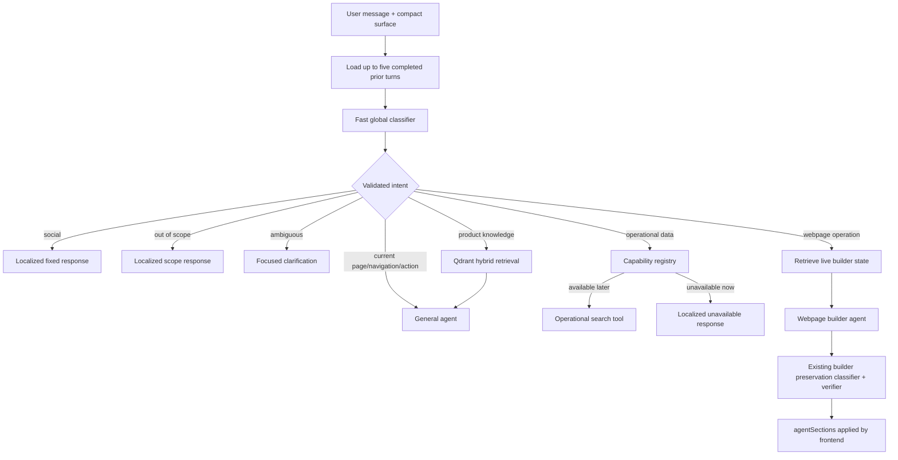

# PLAN — Classifier-first routing for the Genix agent

## Status

Implementation in progress. Phases 1–6 are implemented and covered by backend tests. Phase 7
has live Meta Muse classifier and Spanish Qdrant retrieval checks; authenticated browser tests
and production metrics remain. The v1 schema, intent taxonomy, routing table, frontend surface
contract, and the defaults recorded under “Resolved implementation decisions” are authoritative.

## Goal

Place one fast, reasoning-disabled classifier before every in-app agent request. The
classifier decides which Genix capability should handle the request, which previous turns
are actually related, which language the response should use, and whether live frontend
state must be retrieved before another agent runs.

The classifier is a router and context selector. It does not answer the user, call tools,
authorize operations, or decide that an unavailable capability exists. The backend validates
its small structured verdict and executes the route deterministically.

This plan connects four existing systems without replacing them:

- The default page-reading and page-driving loop in `chat_loop.go`.
- The webpage/e-commerce builder loop in `webpage/`.
- The documentation retriever defined by `PLAN_DOCUMENTATION_RAG.md`.
- The authenticated SSE + POST browser bridge.

## Decisions

- Every user request is classified before the current `ModeID` switch.
- The classifier has thinking/reasoning disabled, deterministic sampling, and a small output
  budget.
- The classifier sees at most five **completed conversation turns**, not five individual
  database messages.
- It selects exact related turn offsets; it does not merely choose a contiguous history
  length.
- It identifies the user language and a response language.
- It receives compact frontend surface metadata, never complete page HTML or builder state.
- A documentation decision causes the backend to execute hybrid Qdrant retrieval before the
  main agent runs. The main agent does not decide whether retrieval is necessary.
- Embedding calls do **not** consume Genix AI inference credits. Classifier and main-agent LLM
  calls continue through the normal inference-credit path.
- Operational company-data queries are distinct from product documentation queries.
- Unavailable future capabilities produce a deterministic localized response; the agent must
  not pretend it queried company records.
- Webpage operations retrieve current builder state immediately after classification and
  before the builder agent runs.
- The existing builder-internal classifier remains in place as a second-stage content-
  preservation gate. It is not replaced by the global classifier.

## Non-goals

- Do not implement sales, purchasing, inventory, finance, or customer record-search tools in
  this phase.
- Do not embed conversation history in Qdrant.
- Do not send full frontend HTML, CSS, ASTs, SVGs, or component registries to the global
  classifier.
- Do not let the classifier bypass access checks, server validation, save confirmations, or
  component method validation.
- Do not make route documentation describe generic permission or tenant abstractions.
- Do not introduce another socket or event-stream transport.

## Historical behavior replaced

Before this implementation, `AgentSession.RunUserMessage` routed directly from `ModeID`:

- Mode 1 runs the general chat/page-agent loop.
- Modes 2 and 3 run the webpage builder loop.

The general loop loads five persisted messages, gives them to the main LLM, and lets that LLM
choose `get_page`, `get_menu`, `navigate`, `invoke_batch`, or `finish`. It has no mandatory
product-knowledge gate. The builder route receives context selected by the frontend's active
manual mode.

The new router moves intent and context selection ahead of both loops.

## Target architecture



## Terminology: two classifiers with separate authority

### Global request classifier

Runs once for every user request. It determines:

- Scope and language.
- Primary and secondary intents.
- Related conversation turns.
- Standalone retrieval wording.
- Required capability categories.
- Whether current page or builder state is required.

It never examines full builder HTML and never authorizes content changes.

### Existing builder classifier

Runs only after the global classifier selects a webpage operation and live builder state is
available. It continues to determine content-preservation policies:

- Which existing sections may change, be removed, or remain locked.
- Whether new sections are allowed.
- Which text, images, and icons may change in a selected section.

The deterministic builder verifier remains authoritative if the builder model violates those
policies. See `webpage/WEBPAGE_LOOP_DESIGN.md`.

## Classifier input contract

The backend builds one compact input containing:

1. The exact current user message.
2. Up to five completed prior turns, newest identifiers assigned by relative offset.
3. Compact frontend surface metadata.
4. Current SPA route.
5. Active frontend mode as a routing hint.
6. A compact registry of capability names and availability.

The classifier must not receive API keys, access lists, source documents, Qdrant payloads,
page HTML, builder HTML, or database records.

### Completed-turn context

A completed prior turn contains:

- `offset`: `-1` for the most recent completed turn through `-5` for the oldest supplied.
- User message.
- Final assistant message.
- Concrete page-action summary, when one exists.
- Route associated with the turn, when known.

The current `loadLastN` function loads database rows, not completed turns. Replace this with a
query/assembly function that returns up to five user + assistant pairs. No database schema
change is required.

Load prior completed turns before saving the current message, or exclude the newly inserted
user row explicitly. The current message must be persisted exactly once regardless of whether
the request takes a fixed-response or agent path.

## Frontend surface contract

The frontend owns the most accurate description of the workspace the user is viewing. It
must send structured surface metadata with every turn.

Conceptual payload:

```yaml
# Compact routing metadata only; never include the complete builder document here.
kind: webpage_builder_editor
route: /webpage-builder/42
page_id: 42
active_agent_mode: ask
has_selected_section: true
selected_section_id: section-hero
selected_section_type: Hero
available_contexts:
  - full_page
  - selected_section
```

Initial `kind` values:

- `erp_page`: normal ERP, configuration, security, or reporting page.
- `webpage_builder_pages`: webpage list/management surface without an open editor document.
- `webpage_builder_editor`: live editor with retrievable page sections.
- `ecommerce_storefront_preview`: rendered storefront preview.
- `unknown`: no page-specific provider registered.

The current route remains a separate top-level turn field for compatibility and diagnostics.
The backend must tolerate missing surface metadata from a stale client by using `unknown`; it
must not silently assume builder context from an unverified route string.

### Frontend registration

Extend the existing `agentModes` page-registration mechanism with a surface provider. Pages
register metadata on mount and clear it on unmount, matching the current context-provider
lifecycle.

The webpage editor registers page ID, selection state, selected section identity/type, and
available context scopes. The builder page-list view registers `webpage_builder_pages` even
though it does not have editable section state.

## Live agent-context retrieval

Do not attach the full builder context to every classifier call. Add a browser command such as
`getAgentContext` to the existing SSE + POST command protocol.

The backend request specifies one validated scope:

- `full_page`: all current sections in the existing builder serialization.
- `selected_section`: only the currently selected section.

The frontend resolves the scope using its registered context provider at command time. This
ensures the builder agent receives state captured **after** classification and as close as
possible to execution.

The response must include enough identity metadata to detect stale selection or page changes:

```yaml
# Identity lets the backend reject state from a page that changed mid-turn.
surface_kind: webpage_builder_editor
page_id: 42
route: /webpage-builder/42
scope: selected_section
selected_section_id: section-hero
content: "<section>...</section>"
```

Reject or reclassify when the response no longer matches the surface used for classification.
Do not continue an edit against a different selected section.

## Classifier output contract

Use one versioned Go struct with strict validation. The following YAML illustrates the wire
shape; the actual provider response is JSON.

```yaml
# The classifier describes routing only; it never produces the user-facing answer.
schema: 1
language: es
response_language: es
scope: genix
primary_intent: product_knowledge
secondary_intents:
  - navigation
requested_operation: read
related_turn_offsets:
  - -1
standalone_request: "¿Puedo anular una orden de compra después de confirmarla?"
required_capabilities:
  - documentation_search
business_domain: logistics
entities:
  - type: purchase_order
    name: ""
builder:
  operation: none
  context_scope: none
  target_section_type: ""
  target_section_reference: ""
  requires_live_state: false
needs_clarification: false
clarification_question: ""
```

### Language values

- `es`: Spanish.
- `en`: English.
- `mixed`: meaningful use of both languages.
- `unknown`: insufficient language signal.

`response_language` must be `es` or `en`. Resolve `mixed` and `unknown` using the current app
language, defaulting to Spanish when no preference exists.

### Scope values

- `genix`: related to Genix, its website/e-commerce builder, its business records, or an
  action in the application.
- `out_of_scope`: unrelated general knowledge or entertainment request.
- `unclear`: the classifier cannot determine whether the reference concerns Genix.

### Primary intent values

- `social`: greeting, thanks, or short conversational courtesy.
- `product_knowledge`: asks what Genix can do, how a workflow behaves, its prerequisites,
  rules, side effects, limitations, or rationale.
- `operational_data`: asks for real company records, aggregates, balances, stock, sales,
  purchases, customers, suppliers, or reports.
- `current_page`: asks about visible state, controls, values, or a deictic reference such as
  “this button”.
- `navigation`: asks where a feature is or asks the agent to take the user there.
- `page_action`: asks the general agent to fill, select, open, save, delete, or otherwise
  operate a non-builder page.
- `confirmation`: confirms or rejects an action proposed in a related turn.
- `webpage_build`: creates or substantially rebuilds a webpage.
- `webpage_add_section`: adds one or more sections while preserving existing sections.
- `webpage_edit_section`: changes a selected or explicitly referenced section.
- `webpage_remove_section`: removes explicitly referenced sections.
- `webpage_reorder_section`: changes section order.
- `webpage_inspect`: asks about the current builder composition or design state.
- `out_of_scope`: unrelated request.
- `ambiguous`: insufficient information for deterministic routing.

### Requested-operation values

- `read`
- `navigate`
- `create`
- `update`
- `delete`
- `confirm`
- `reject`
- `none`

The operation is a routing hint. It never bypasses the existing rule that the user must
confirm save/send and destructive operations where applicable.

### Builder operation values

- `none`
- `build_page`
- `add_section`
- `edit_section`
- `remove_section`
- `reorder_section`
- `inspect_page`

### Builder context scopes

- `none`
- `full_page`
- `selected_section`

Validate operation/scope combinations mechanically:

| Builder operation | Required live scope |
| --- | --- |
| `build_page` | `full_page` when editing an existing page; empty/full specification for a new page |
| `add_section` | `full_page` |
| `edit_section` | `selected_section` when the target is selected; otherwise `full_page` plus target resolution |
| `remove_section` | `full_page` |
| `reorder_section` | `full_page` |
| `inspect_page` | `full_page` |

## Conversation relationship selection

The classifier selects explicit offsets from the supplied set `[-5, -4, -3, -2, -1]`.
Reject duplicate, out-of-range, or forward offsets.

Pass selected turns to the downstream agent in chronological order. Include each selected
turn's user message, assistant response, and action-summary system note. Do not pass unrelated
turns merely because they occur between related ones.

Examples:

| Current message | Relevant offsets | Reason |
| --- | --- | --- |
| “¿Y después puedo anularla?” after an OC discussion | `[-1]` or the exact OC turns | Resolves “la” and “después” |
| “Sí, guárdalo” after a save confirmation | `[-1]` | Carries pending action and confirmation |
| “Ahora explícame el arqueo de caja” after an unrelated sales discussion | `[]` | New independent topic |
| “Haz lo mismo con el segundo producto” | Exact turns defining “lo mismo” and the product list | Action depends on earlier values |

The classifier may select non-contiguous offsets. A simple `history_length` field is therefore
insufficient and must not be used.

## Standalone request construction

`standalone_request` is used for documentation retrieval and future operational search-tool
selection. The main agent still receives the exact original user message.

The classifier must:

- Preserve the user's language and ERP vocabulary.
- Resolve pronouns and omitted nouns only from selected turns and current surface metadata.
- Preserve negations, conditions, dates, quantities, and requested operations.
- Never invent record IDs, entity names, dates, amounts, statuses, or filters.
- Set `needs_clarification=true` when a safe standalone request cannot be formed.

Example:

| Previous context | Current message | Standalone request |
| --- | --- | --- |
| User asked how to confirm an OC | “¿Y después puedo anularla?” | “¿Puedo anular una orden de compra después de confirmarla?” |
| Agent asked whether to save Caja Principal | “Sí, guárdala” | “Confirmar el guardado de la caja llamada Caja Principal.” |

## Capability registry

Maintain a backend registry as the source of truth. The classifier receives only compact
capability names; the backend decides whether they are implemented and callable.

Initial capabilities:

| Capability | Status | Execution |
| --- | --- | --- |
| `documentation_search` | available | Qwen query embedding + Qdrant dense/BM25 RRF |
| `current_page` | available | Existing `get_page` bridge command |
| `menu` | available | Existing access-filtered `get_menu` command |
| `browser_action` | available | Existing `navigate` and `invoke_batch` paths |
| `webpage_builder` | available | Existing `webpage.RunTurn` after live-state retrieval |
| `sales_search` | future | Operational sales-record search |
| `purchase_search` | future | Operational purchase-record search |
| `inventory_search` | future | Operational product/stock search |
| `finance_search` | future | Operational cash/bank/accounting search |
| `customer_search` | future | Operational customer search |
| `supplier_search` | future | Operational supplier search |

Never describe a future capability to the classifier as available. A classifier verdict can
request one; the router checks the registry and selects the localized unavailable path.

## Routing matrix

| Verdict | Deterministic next step |
| --- | --- |
| `social` | Return a short localized greeting/help template without Qdrant or main-agent call |
| `out_of_scope` | Return the localized Genix-scope template without a main-agent call |
| `ambiguous` or `scope=unclear` | Return the validated focused clarification question |
| `product_knowledge` | Execute documentation retrieval, then run the main agent with bounded evidence |
| `operational_data` + available capability | Execute the registered operational search path |
| `operational_data` + unavailable capability | Return localized unavailable response and optionally offer navigation to a documented report |
| `current_page` | Run the main agent with selected history and require `get_page` |
| `navigation` | Retrieve documentation when feature meaning is needed; validate route against live accessible menu; then run main agent |
| `page_action` or `confirmation` | Run main agent with selected history and current page tools |
| Any `webpage_*` intent with editor state | Retrieve required live builder context, then run webpage agent |
| `webpage_*` intent on builder page list | Navigate/create/select a page before requesting editor context, or ask a focused clarification |
| `webpage_*` intent outside builder | Use accessible navigation to enter builder; never pretend editor state already exists |

Secondary intents define a sequence, not a second independent answer. Example: a
`product_knowledge` primary intent with `navigation` secondary first retrieves evidence, then
the main agent can explain and navigate if requested.

## Context-sensitive disambiguation

Apply this precedence:

1. Explicit current user wording.
2. Current frontend surface.
3. Selected related conversation turns.
4. Focused clarification.

The frontend surface resolves ambiguous nouns but must not override an explicit different
domain.

| Surface | Request | Expected intent |
| --- | --- | --- |
| Webpage editor | “Add a product section” | `webpage_add_section`, target `ProductGrid` or equivalent |
| Webpage editor, Hero selected | “Make this title larger” | `webpage_edit_section`, selected-section scope |
| Product maintenance | “Add a product” | General ERP `page_action` |
| Webpage editor | “How do I create an inventory product in Genix?” | `product_knowledge`, not builder editing |
| Webpage editor | “What were today's sales?” | `operational_data`, builder surface irrelevant |
| Builder page list | “Create a landing page for shoes” | `webpage_build` |
| Unknown surface | “Add a product section” | `ambiguous` unless history resolves the target |

## Documentation retrieval path

When `documentation_search` is required:

1. Use `standalone_request` as the query input.
2. Fetch the connected browser's accessible menu routes.
3. Extend `knowledge.SearchOptions` with `AllowedRoutes []string`.
4. Add a Qdrant match-any route condition before dense and BM25 prefetch.
5. Keep `status=implemented` and `documentation_current=true` filters.
6. Retrieve dense and lexical candidates and fuse with native RRF.
7. Assemble a bounded agent-facing evidence object containing citation ID, route, page title,
   section title/type, and content.
8. Keep hashes and point IDs in diagnostics; omit them from the main-model prompt unless needed
   for debugging.
9. Supply evidence to the main agent as turn-local grounded context.

Embedding calls are intentionally exempt from Genix AI inference-credit accounting. They still
use bounded retries, dimensional validation, private logging, and provider error handling.

### Evidence lifetime

The general chat loop currently prunes all but two recent tool rounds. Retrieved documentation
must not disappear when a turn continues through menu, navigation, and page tools.

Store bounded documentation evidence in separate turn-local context and attach it to every
subsequent main-model request for that turn. Do not persist raw retrieved passages in ScyllaDB.
Persist only the final assistant answer and normal action summary. A later follow-up can retrieve
again using its classifier-produced standalone request.

## Operational-data path

Documentation explains system behavior; it never answers live company-record questions.

Example:

> “Dame la última venta de Coca Cola de este mes.”

The classifier may extract non-authoritative hints:

- Domain: sales.
- Entity type: product.
- Entity text: Coca Cola.
- Time reference: current month.
- Sort: newest.
- Limit: one.

Future backend tools must resolve names to IDs, validate dates and permissions, and construct
database queries. Never execute raw classifier-generated filters directly. Until the capability
exists, return a localized unavailable response and optionally offer navigation to the closest
documented report page.

## Builder routing and preservation

After a `webpage_*` verdict:

1. Validate that the frontend surface supports the requested builder context.
2. Request the freshest context through `getAgentContext`.
3. Confirm page/route/selection identity did not change.
4. Map the global builder intent to existing builder mode and explicit operation constraints.
5. Run the existing builder-internal classifier on the retrieved state.
6. Run the builder agent and deterministic preservation verifier.
7. Return `agentSections` through the existing event path.

Initial mapping:

| Global intent | Existing builder mode | Additional constraint |
| --- | --- | --- |
| `webpage_build` | `ModeBuildPage` | Rewrite only when explicitly requested |
| `webpage_add_section` | `ModeBuildPage` | Preserve all existing sections; add only requested count/type |
| `webpage_edit_section` | `ModeEditSection` when selected, otherwise `ModeBuildPage` with resolved target | Only target section may change |
| `webpage_remove_section` | `ModeBuildPage` | Only explicitly resolved sections may be absent |
| `webpage_reorder_section` | `ModeBuildPage` | Preserve section content; change only requested order |
| `webpage_inspect` | Builder-aware read path | No mutation |

For `add_section`, verification must ensure:

- Every existing section remains present.
- Existing order remains unchanged unless placement was requested.
- The allowed number of new sections is not exceeded.
- Unrelated existing section content remains unchanged.

For `edit_section`, verify target identity and reject modifications to untargeted sections.

## Localized direct responses

Do not ask the classifier to compose direct responses. Keep versioned backend templates selected
by `response_language`.

Required template categories:

- Social greeting/help.
- Out-of-scope boundary.
- Unsupported operational capability.
- Classification temporarily unavailable.
- Builder state changed/stale.
- No documentation establishes the answer.

Example out-of-scope meaning:

- Spanish: the assistant identifies itself as the Genix assistant and offers help with the
  system, its workflows, and company information available through Genix.
- English: the equivalent concise boundary.

## Classifier model contract

Use a separate configured classifier model, independent from the user-selected main model.
The exact model ID must be chosen before implementation and tested with both Spanish and English
evaluation cases.

Required request settings:

- Reasoning/thinking disabled.
- Temperature zero.
- Small maximum output-token budget.
- No tools.
- No page or documentation content.
- Strict JSON instruction and, when supported reliably by the provider/model, JSON Schema
  response formatting.

The existing builder subagent pattern (`subagentNoReasoning`, JSON extraction, bounded retry)
is useful implementation evidence, but the global classifier needs its own package-level client,
schema validation, metrics, and failure policy.

### Parsing and validation

1. Decode the response into the versioned struct.
2. Reject unknown schema versions, enums, capability names, duplicate offsets, invalid offsets,
   unsafe builder operation/scope combinations, and contradictory scope/intent pairs.
3. Normalize only allowed whitespace; do not silently map arbitrary strings to valid intents.
4. Retry once for malformed model output.
5. After the retry fails, return the localized temporary-classification response. Do not bypass
   classification and let the main agent guess.

The classifier's optional `reason` must not be treated as chain-of-thought, logged verbatim, or
passed to the user. Prefer omitting a reason entirely from the production schema.

## Main-agent prompt contract

The downstream main agent receives:

- Its normal concise system prompt.
- Only classifier-selected completed turns.
- The exact current user message.
- A compact routing note: language, intent, requested operation, and current surface.
- Bounded retrieved documentation when required.
- Existing live page/menu/action tools appropriate to the route.

The main agent must:

- Ground product claims in supplied documentation evidence.
- Use live page state for current values and controls.
- Never claim live company data unless an operational tool returned it.
- Use the response language selected by the classifier.
- Preserve the existing save/send confirmation rule.
- Continue placing only concrete page actions in the persisted `summary`.

Do not give every tool to every routed request when a smaller deterministic set suffices. The
capability registry should construct the available tool list for the route.

## Failure behavior

### Classifier unavailable or invalid twice

Return a short localized temporary error. Do not fall back to unrestricted main-agent behavior,
because that would bypass scope enforcement and deterministic context selection.

### Documentation embedding or Qdrant unavailable

The main agent may still inspect the current page or menu but must not claim detailed business
rules. Return or inject an explicit degraded-knowledge state.

### No documentation result

Say the current documentation does not establish the answer. Offer the closest accessible page
only when retrieval or the menu provides one; never invent a route.

### Operational capability unavailable

Return the localized unsupported-capability template. Optionally offer access-filtered navigation
to a relevant report, without claiming that any records were queried.

### Builder state missing or changed

Do not run the builder agent. Ask the user to open/select the target or retry after the editor
state stabilizes.

## Security and trust boundaries

- Treat classifier fields as untrusted model output.
- Validate every enum, list size, string size, offset, capability, route, and builder scope.
- Current authenticated user/company/session remain authoritative in `PostAgentTurn`.
- Live browser menu remains authoritative for route accessibility.
- Backend handlers and component methods remain authoritative for data validation and mutation.
- Never let surface metadata grant access; it only describes frontend state.
- Never execute raw operational filters produced by the classifier.
- Preserve one in-flight turn per tab and the existing timeout.
- Treat prompt-injection-like user text as data; the classifier cannot change its schema or
  capability registry.

## Logging and observability

Log structured routing diagnostics without full user messages or classifier prose:

- Request/session correlation identifier and shortened tab ID.
- Classifier model, duration, retry count, and response size.
- Language, scope, primary intent, secondary intents, requested operation.
- Selected turn offsets and count, not their text.
- Required capabilities and availability result.
- Surface kind, route label, builder scope, and stale-state result.
- Documentation query hash, result count, routes, citations, and latency.
- Final routed agent and total turn duration.

Never log:

- Full user questions in production.
- Full conversation history.
- Complete builder HTML or documentation passages.
- Embedding vectors, API keys, session tokens, or classifier raw output.

Add counters for intent distribution, classifier failures/retries, out-of-scope turns,
unsupported capability requests, documentation hit/no-hit, builder state mismatches, and main-
agent iterations after classification.

## Implementation phases

### Phase 1 — Contracts and fixtures

1. Define versioned classifier input/output Go structs and enums.
2. Define `SurfaceContext` and live-context response contracts in Go and TypeScript.
3. Define the capability registry and localized fixed-response categories.
4. Build a labeled Spanish/English classifier fixture set before connecting routing.
5. Select and configure the classifier model.

### Phase 2 — Conversation assembly

1. Implement loading/assembling the last five completed turns.
2. Assign stable relative offsets.
3. Preserve assistant action summaries with their turns.
4. Refactor turn persistence so every path saves the current user and final response exactly once.

### Phase 3 — Frontend surface and live context

1. Add surface-provider registration to `agentModes`.
2. Populate builder-list and builder-editor surfaces.
3. Add surface metadata to `TurnRequest`.
4. Add `getAgentContext` to the existing command protocol and frontend dispatcher.
5. Validate page/selection identity on the backend response.

### Phase 4 — Global classifier

1. Implement the separate reasoning-disabled classifier client.
2. Add strict parsing, validation, one retry, and privacy-safe logs.
3. Run it before the current mode switch.
4. Implement direct social, out-of-scope, ambiguous, and unavailable-capability paths.
5. Pass only selected history into downstream agents.

### Phase 5 — Documentation routing

1. Add `AllowedRoutes` to hybrid search options and tests.
2. Retrieve the live accessible menu before Qdrant search.
3. Execute retrieval automatically from a product-knowledge verdict.
4. Build bounded turn-local documentation context.
5. Update main-agent grounding and degraded-mode instructions.

### Phase 6 — Builder routing

1. Map global webpage intents to builder modes and explicit operation constraints.
2. Retrieve full-page or selected-section context only after classification.
3. Retain the builder-internal preservation classifier.
4. Extend deterministic verification for exact add/remove/reorder constraints.
5. Preserve the existing `agentSections` frontend application path.

### Phase 7 — Integration and evaluation

1. Run unit tests for every classifier schema rule and routing branch.
2. Run fake-LLM tests for malformed JSON, retry, and unavailable classifier behavior.
3. Run live Qdrant tests for access-filtered Spanish documentation questions.
4. Run browser integration tests from ERP pages, builder list, and builder editor.
5. Measure classifier latency, route accuracy, context reduction, retrieval precision, and main-
   agent iteration count.

## Evaluation cases

The initial labeled suite must include at least:

| Surface | Current request | Expected route |
| --- | --- | --- |
| Any | “Hola” | `social`, no Qdrant/main agent |
| Any | “¿Quién ganó el partido?” | `out_of_scope`, fixed Spanish response |
| ERP finance | “¿Qué pasa si el arqueo tiene diferencia?” | documentation retrieval + main agent |
| ERP logistics | “¿Puedo anular una OC confirmada?” | documentation retrieval + main agent |
| Any | “Dame la última venta de Coca Cola” | unavailable `sales_search`, no fabricated result |
| Current ERP page | “¿Qué valor tiene este campo?” | current-page agent with `get_page` |
| Current ERP page | “Llena el proveedor ACME” | page action; save still requires confirmation |
| Follow-up | “Sí, guárdalo” | confirmation with exact related prior turn |
| Unrelated follow-up | “Ahora explícame arqueo” | no unrelated history passed |
| Builder editor | “Add a product section” | add section, full-page live context |
| Builder editor with selection | “Make this title larger” | edit selected section only |
| Product maintenance | “Add a product” | general ERP page action, not website section |
| Builder editor | “How do I create an inventory product?” | product documentation, not builder routing |
| Builder list | “Create a shoe landing page” | webpage build workflow |
| Unknown surface | “Add a product section” | clarification unless history resolves it |
| English follow-up | “Can I cancel it afterwards?” | English response + selected related turn + standalone query |

Add adversarial cases for prompt injection, invalid mixed intents, contradictory surface/mode,
stale selected section, inaccessible routes, empty documentation results, and classifier output
with unknown enum values.

## Acceptance criteria

- Every in-app user request reaches the global classifier before agent routing.
- Classifier reasoning is disabled and its response conforms to the versioned validated schema.
- The classifier sees no more than five completed turns and no full page/builder content.
- Only explicitly selected prior turns reach the downstream agent.
- Independent questions receive no unrelated conversation history.
- Follow-up pronouns and confirmations receive the exact context required to resolve them.
- Spanish, English, mixed, and unknown language behavior is deterministic.
- Product-knowledge requests automatically retrieve access-filtered current documentation.
- Embeddings do not charge Genix AI inference credits.
- Operational-data requests never use route documentation as if it were company data.
- Unavailable future search tools produce deterministic localized responses.
- Builder-surface ambiguity routes “product section” to webpage editing, while explicit ERP
  product requests still route to product documentation or maintenance.
- Builder state is retrieved after classification and identity-checked before execution.
- The existing builder preservation classifier and deterministic verifier remain enforced.
- Existing SSE/POST transport, authentication, one-turn guard, and `agentSections` application
  continue working.
- No path lets classifier output bypass route access, component validation, backend validation,
  or confirmation requirements.

## Decisions required before implementation

Resolved implementation decisions:

1. Reuse Meta `muse-spark-1.2-contributor`; Meta receives `reasoning_effort=minimal` because it
   rejects a fully disabled value.
2. Use the documented version-1 enums and output fields.
3. Keep localized direct responses as concise backend-owned Spanish/English templates.
4. Make `webpage_inspect` a read-only builder-aware path.
5. From the builder page list, ask the user to choose a target rather than creating one
   automatically.
