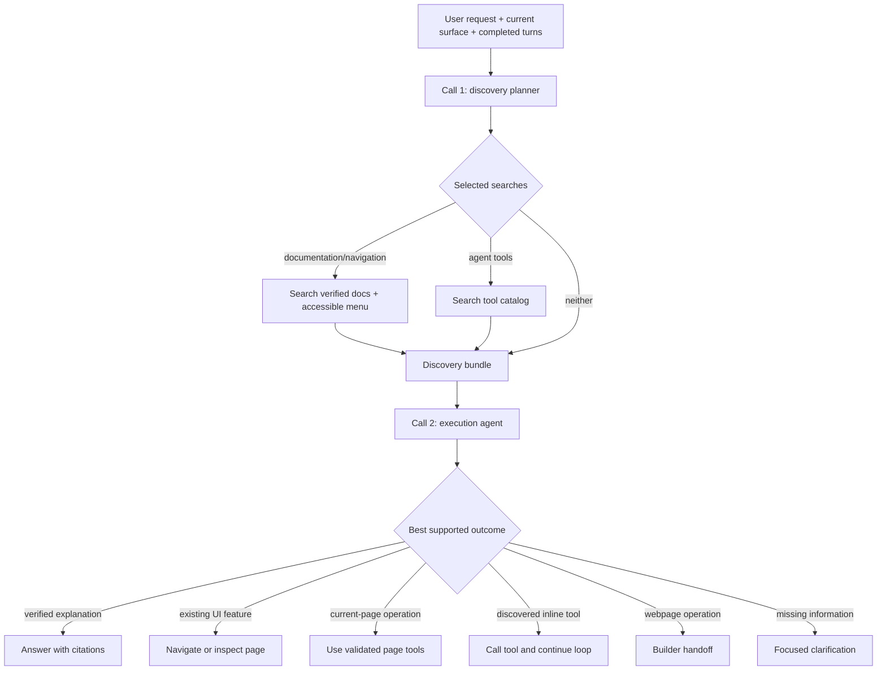

# PLAN — Discovery-first routing and dynamic agent tools

## Status

Implemented on 2026-08-12. This design replaces the removed global hard-routing contract in
`PLAN_CLASSIFIER_ROUTER.md`. The discovery planner, parallel documentation/navigation and
tool-catalog searches, empty phase-one tool catalog, execution bundle, UI-first policy,
backend route validation, builder handoff, evaluation command, and regression fixtures are
now the runtime architecture.

Authenticated browser acceptance tests and production metrics remain deployment validation,
not missing implementation. Genix is pre-alpha, so the old verdict and capability contracts
were removed instead of maintained behind a compatibility switch.

`PLAN_DOCUMENTATION_RAG.md`, `PLAN_ROUTE_DOCUMENTATION.md`, the authenticated browser
bridge, and the webpage builder's internal preservation classifier remain authoritative for
their own subsystems.

## Goal

Replace the classifier that selects one exclusive capability with a two-call flow:

1. A fast **discovery planner** understands the request and decides which read-only
   discovery searches are necessary.
2. The backend executes documentation/navigation search and agent-tool catalog search in
   parallel when both were requested.
3. An **execution agent** receives the original request, the validated discovery plan, the
   search results, the current frontend surface, and the tools it may actually call. It then
   decides whether to answer, navigate, inspect or operate a page, invoke a discovered data
   tool, hand off to the webpage builder, or ask a focused clarification.

The first implementation includes the `search_agent_tools` contract and orchestration, but
its catalog is intentionally empty. An empty tool result is a successful discovery result,
not an error and not evidence that the user asked for an unsupported operation.

## Genix context supplied to both agents

Use this compact stable context instead of expecting the model to infer what Genix is:

> Genix is a web-based ERP and ecommerce application for small businesses. Users manage
> products, inventory, sales, purchases, customers, suppliers, finance, reports, and
> storefronts primarily through application pages, while some business data can also be
> retrieved through specialized agent tools.

The prompt must also state that accessible application pages are authoritative for UI
workflows, tool-search results are authoritative for inline data capabilities, and neither
agent may invent a route or tool.

## Problem with the current router

The current global classifier mixes two different decisions:

- The user's business goal, such as creating a product or viewing a sales report.
- The delivery mechanism, such as documentation, navigation, current-page actions, or an
  inline company-data tool.

That coupling makes a probabilistic label a hard capability gate. For example, the live
classifier labeled “crear un producto” as `product_knowledge` while also correctly labeling
the operation as `create`. The router then removed navigation and page tools and returned an
unavailable company-data response.

The classifier also receives abstract capability flags but not enough application-feature
information to distinguish these valid outcomes:

- Navigate to an existing Sales Report page.
- Use a future inline sales-report tool.
- Explain how Genix reports work from verified documentation.

Discovery must happen before the final execution method is selected.

## Decisions

- One user message remains one persisted conversation turn even though it can use two or
  more internal model calls.
- Call 1 is a fixed, fast discovery-planner model with deterministic sampling and reasoning
  disabled.
- The discovery planner cannot answer the user, navigate, inspect page content, mutate UI
  state, or query company records.
- Call 1 returns a strict, versioned `DiscoveryPlan`. It does not return a hard
  `primary_intent`, `required_capabilities`, or an unavailable-capability response.
- The plan independently selects documentation/navigation search and agent-tool search.
- The backend starts all selected discovery searches together and waits for all results.
  One failed search does not discard a successful sibling result.
- Documentation and navigation are one discovery surface because route documentation is
  already linked to frontend routes.
- Route discovery is always filtered by the live authenticated menu. The model cannot make
  an inaccessible route executable.
- `search_agent_tools` searches a backend-owned catalog and returns tool descriptors, not
  company records.
- The catalog is empty in phase one. `tools: []` with `status: ok` is expected.
- Call 2 receives the validated plan verbatim, each discovery result, and the exact original
  user message. It does not depend on hidden reasoning or free-form text from call 1.
- General Genix requests retain navigation and page-reading options even when no inline tool
  exists. Empty tool discovery must never produce the current “company-data query is not
  available” fixed response by itself.
- When an applicable UI page and inline tool both exist, explicit wording decides. With no
  expressed preference, prefer the existing Genix UI page.
- The backend remains authoritative for authentication, route access, tool availability,
  parameter validation, tenant/company scoping, confirmation, and mutations.
- The webpage builder keeps its specialized agent, live-context retrieval, preservation
  classifier, and deterministic verifier.

## Non-goals

- Do not implement `GetProductsSales`, `GetProductInventory`, or any other operational data
  tool in the first phase.
- Do not let `search_agent_tools` execute a matched tool.
- Do not send the complete menu, full route documentation, page HTML, builder HTML, database
  records, or a future complete tool catalog to call 1.
- Do not make route documentation a replacement for live access checks.
- Do not let discovery authorize a save, send, delete, confirmation, or builder mutation.
- Do not add another transport; continue using the existing SSE + POST browser bridge.
- Do not persist discovery tool-call transcripts as separate chat messages.

## Terminology

### Discovery planner

The first model call. It converts the exact user request and selected conversational context
into a small search plan. It selects information sources but does not decide the final action.

### Documentation/navigation search

A read-only backend tool named `search_documentation_navigation`. It searches verified route
documentation and the user's accessible menu, returning evidence passages and possible routes.

### Agent-tool search

A read-only backend tool named `search_agent_tools`. It searches metadata for executable
agent tools such as future `GetProductsSales` or `GetProductInventory`. It never calls those
tools.

### Execution agent

The second model call and its existing tool loop. It chooses and performs the final response
path using the discovery bundle supplied by the backend.

### Internal call versus conversation turn

“Call 1” and “call 2” are internal LLM calls inside a single user-visible turn. The user sees
one progress sequence and one final assistant response.

## Target architecture



## End-to-end request lifecycle

1. Validate the incoming chat message and current frontend surface.
2. Load up to five completed prior turns before saving the current user row.
3. Save the current user message exactly once.
4. Call the discovery planner with the exact message, compact surface, current route, app
   language, and completed-turn summaries.
5. Strictly decode and validate `DiscoveryPlan`.
6. Select only the completed turns named by valid related offsets.
7. Start each requested discovery search concurrently.
8. Assemble one bounded `DiscoveryBundle`, preserving successes, empty results, and typed
   failures separately.
9. Select the execution envelope and expose only backend-approved tools.
10. Call the execution agent with the exact request, selected turns, plan, bundle, and tool
    schemas.
11. Continue the existing execution tool loop until `finish`, a validated builder handoff,
    or the maximum iteration limit.
12. Persist one final assistant message and one concrete page-action summary.

## Call 1 input contract

Reuse the current safe inputs where possible:

- Schema version.
- Exact current user message.
- Up to five completed turns with offsets `-1` through `-5`.
- Compact frontend surface metadata.
- Current SPA route.
- Active frontend mode as a hint, not authority.
- Application language.
- The static two-line Genix context.
- A declaration that two discovery sources exist.

Do not send route lists or tool catalog entries to call 1. The purpose of call 1 is to decide
what to search, not to select from a large inventory.

## Discovery plan contract

Replace the current `routing.Verdict` with a smaller semantic and retrieval contract:

```yaml
# Call 1 selects evidence sources; it does not authorize execution.
schema: 1
language: es
response_language: es
scope: genix
goal: manage_record
operation: create
domain: products
entities:
  - type: product
    name: Aceite Tondero
delivery_preference: unspecified
related_turn_offsets: []
standalone_request: Crear un producto llamado Aceite Tondero con precio de 12 soles.
searches:
  documentation_navigation:
    needed: true
    query: Crear un producto
  agent_tools:
    needed: false
    query: ""
builder:
  operation: none
  context_scope: none
  requires_live_state: false
needs_clarification: false
clarification_question: ""
```

### Goal values

Begin with broad semantic goals that do not encode the execution channel:

- `social`
- `explain_product`
- `manage_record`
- `view_report`
- `query_company_data`
- `inspect_current_page`
- `operate_current_page`
- `webpage_operation`
- `out_of_scope`
- `unclear`

### Operation values

- `read`
- `create`
- `update`
- `delete`
- `confirm`
- `reject`
- `none`

### Delivery preference values

- `ui`: explicit “open”, “go to”, “take me”, or equivalent UI wording.
- `inline`: explicit “show me here”, “summarize”, “calculate”, or equivalent direct-result
  wording.
- `explanation`: asks how or why Genix behaves a certain way.
- `unspecified`: no reliable preference. The execution agent applies the UI-first default.

### Search selection guidance

The discovery planner should request documentation/navigation search when the request may be
answered or fulfilled by an existing Genix feature, route, documented workflow, report page,
or builder entry point.

It should request agent-tool search when the request asks for actual company records,
aggregates, stock, balances, metrics, or an inline report. It may request both searches for a
request such as “I want the sales report,” because both an existing page and an inline tool
could satisfy it.

Social and clearly out-of-scope messages need neither search. Current-page requests normally
need neither discovery search because call 2 can use `get_page`; a route-dependent current-page
reference may still request documentation/navigation search.

A short confirmation or rejection of a pending record action uses `manage_record` with
`operation: confirm` or `operation: reject`, references the required completed turn, and runs
neither discovery search. Call 2 inspects the live page, while the backend separately validates
the current route against the authenticated menu before exposing page mutations.

## `search_documentation_navigation` contract

### Inputs

```yaml
# The backend adds authenticated routes; the planner never supplies access filters.
query: Quiero crear un producto.
domain: products
operation: create
result_limit: 6
```

The backend supplies `AllowedRoutes` from `GetMenu`. Reject planner-supplied routes or access
identifiers.

### Retrieval sources

Use both sources because some accessible routes may not yet have canonical
`DOCUMENTATION.md` files:

1. Hybrid Qdrant retrieval over verified route documentation, filtered by accessible routes.
2. Matching over accessible menu option names and generated route descriptions.

Qdrant passages provide product claims and citations. Menu matches provide navigable feature
candidates even when detailed documentation is absent. A menu description is sufficient to
suggest a route but not to invent business rules.

### Output

```yaml
# Routes are accessible candidates; passages are verified explanatory evidence.
status: ok
routes:
  - route: /business/products
    page_name: Products
    description: Create and edit products, prices, categories, images, and units.
    matched_by: menu_and_documentation
    score: 0.94
passages:
  - citation_id: business.products#capability.create
    route: /business/products
    page_title: Products
    section_title: Create a product
    content: Products are created from the Products view.
diagnostics:
  documentation_matches: 1
  menu_matches: 1
```

Do not expose Qdrant point IDs, hashes, filesystem paths, access resources, or internal scores
that the execution agent does not need. Route candidates must retain the exact route string
from the authenticated menu.

### Ranking

- Deduplicate by exact normalized route.
- Prefer a route supported by both documentation and menu-text matching.
- Otherwise rank by the best available source score.
- Retain the best bounded passages per route.
- Never return a documentation route that is absent from `AllowedRoutes`.
- Keep route candidates and passages separate so the execution agent knows which claims are
  documented and which routes are merely available.

## `search_agent_tools` contract

### Purpose

Search a backend-owned catalog of executable agent tools without executing them. Future
entries may include:

- `GetProductsSales`
- `GetProductInventory`
- `GetCustomerBalance`
- `GetPurchasesSummary`

Catalog entries must describe the domain, supported operation, required and optional
arguments, output type, read/write behavior, availability, and permission requirements.

### Inputs

```yaml
# Search wording preserves dates, filters, entities, and desired output.
query: Resume las ventas por producto del mes pasado aquí.
domain: sales
operation: read
delivery_preference: inline
result_limit: 6
```

### Phase-one output

The catalog starts empty and the tool must return:

```yaml
# Empty discovery is successful and must not stop navigation or documentation paths.
status: ok
catalog_version: 1
tools: []
```

Do not return an error, synthetic unavailable tool, placeholder schema, or fixed user-facing
message. Log the empty result for metrics, then let call 2 use documentation, navigation,
current-page tools, or clarification.

### Future non-empty output

```yaml
# Descriptors let the backend expose only matched executable schemas to call 2.
status: ok
catalog_version: 1
tools:
  - name: GetProductsSales
    description: Return product sales for a validated date range.
    domain: sales
    operation: read
    output_type: inline_report
    required_arguments:
      - date_from
      - date_to
    optional_arguments:
      - product_id
    read_only: true
```

The search result is advisory. Before exposing a matched tool, the backend must resolve its
name to a registered implementation and re-check availability and permissions. Unknown,
stale, or unavailable catalog entries are omitted and logged.

## Parallel discovery execution

The backend, not the model provider, owns concurrency. After validating `DiscoveryPlan`, build
zero, one, or two search jobs and run both selected jobs under the same turn context.

Requirements:

- Bound each search with its own timeout.
- Preserve deterministic result ordering in `DiscoveryBundle` regardless of completion order.
- Do not cancel a successful documentation search because tool search failed, or vice versa.
- Cancel both when the user turn context is canceled.
- Record duration and result counts separately.
- Never run the same selected search twice during one discovery phase.
- Do not count embedding calls as Genix inference-credit usage; preserve the existing credit
  policy for model calls.

Conceptual bundle:

```yaml
# Typed results prevent an empty catalog from being confused with infrastructure failure.
plan:
  goal: view_report
  operation: read
  domain: sales
  delivery_preference: unspecified
documentation_navigation:
  status: ok
  routes:
    - route: /sales/reports
      page_name: Sales Reports
  passages: []
agent_tools:
  status: ok
  catalog_version: 1
  tools: []
```

## Call 2 execution context

The execution agent receives:

1. Static Genix context and execution rules.
2. Exact original user message.
3. Selected completed turns in chronological order, including action summaries.
4. Current route and compact frontend surface.
5. The validated `DiscoveryPlan`.
6. Documentation/navigation result or typed absence/failure.
7. Agent-tool result or typed absence/failure.
8. Backend-approved executable tool schemas.

Bound the discovery context. Include only the highest-ranked route candidates, relevant
passages, and matched tool descriptors.

## Execution tools and authority

For ordinary in-scope Genix requests, call 2 may receive:

- `get_menu`
- `navigate`
- `get_page`
- `finish`

Expose `invoke_batch` only for a validated record/current-page operation or confirmation. For
`manage_record`, bind page actions to the primary authenticated route returned by discovery;
an action attempted before reaching that route is rejected by the backend. A create request
authorizes opening and filling the form with supplied values, but save/send still requires a
separate explicit confirmation.

Future specialized data tools are added dynamically only when all conditions hold:

1. `search_agent_tools` returned the descriptor.
2. The backend registry resolves the exact tool name.
3. The implementation is available.
4. The current user/company is authorized.
5. The tool schema passes startup and request-time validation.

In phase one, no specialized data tools are exposed because the catalog result is empty.

## Execution decision policy

Call 2 applies this precedence:

1. Explicit current user wording.
2. Current frontend surface and route.
3. Validated discovery plan.
4. Accessible documentation/navigation candidates.
5. Available matched agent tools.
6. Selected conversation context.
7. Focused clarification when required.

Outcome rules:

- Explicit navigation wording selects an accessible route.
- Create, update, or delete requests default to the relevant management page. If already on
  the correct page, inspect it before proposing or applying page actions.
- Explicit inline wording selects a matching data tool when one exists.
- A neutral report request prefers an existing Genix report page.
- A “how”, “why”, prerequisite, rule, or limitation question prefers verified documentation.
- If documentation explains a workflow and supplies a route, the agent may answer and offer
  or perform navigation according to the request.
- An empty tool list does not mean the requested UI feature is unavailable.
- If a required inline tool is absent but a relevant UI page exists, navigate or offer that
  page instead of returning a generic unavailable message.
- If neither evidence nor a supported action exists, ask one focused clarification or state
  the exact verified limitation without pretending records were queried.
- Never produce a chart, aggregate, balance, or record claim without actual tool data or
  verified visible page data.

## Webpage builder preservation

The discovery plan retains a builder decision because webpage operations require live editor
state and a specialized execution loop.

- Call 1 may select `goal=webpage_operation` from explicit wording plus surface metadata.
- Documentation/navigation search may locate the builder when the user is outside it.
- If the correct builder editor is already active, retrieve live state after discovery and
  validate route, page ID, selection, and scope exactly as today.
- Hand the request, selected history, and live content to `webpage.RunTurn`.
- Keep the builder's internal content-preservation classifier and deterministic verifier.
- Tool catalog search is normally unnecessary for builder-only changes.

## Social, out-of-scope, and clarification paths

The planner may select no searches for social or clearly out-of-scope requests. The execution
stage can return the existing localized response without receiving page-mutation tools.

For `scope=unclear` or `needs_clarification=true`, the backend may use the validated focused
question directly only when no discovery result could resolve it. Otherwise call 2 decides
whether the new evidence removes the ambiguity.

This prevents the first model from prematurely asking a question that route or tool discovery
could answer.

## Failure behavior

Represent these states separately:

- `ok` with results.
- `ok` with an empty result.
- `unavailable` because a dependency failed.
- `invalid` because untrusted planner output failed validation.

Rules:

- Invalid discovery-plan JSON retries once, matching the current classifier policy.
- If call 1 remains invalid or unavailable, return the localized interpretation failure and
  persist a completed turn.
- Documentation failure does not erase a successful tool-search result.
- Tool-search failure does not erase accessible documentation/routes.
- An empty catalog is `ok`, never `unavailable`.
- If both searches fail, call 2 may still inspect/navigate through live page tools when safe;
  otherwise return a localized execution failure.
- Provider and internal errors remain out of user-facing messages but are logged with a
  stable stage and typed cause.

## Persistence and history

- Load completed prior turns before inserting the current user message.
- Persist the current user exactly once.
- Keep discovery plans, search queries, search results, tool calls, and tool results ephemeral
  to the active turn.
- Persist only the final assistant response and concrete page-action summary.
- The summary records actions actually completed, not routes or tools merely discovered.
- Preserve exact selected-turn offsets from call 1 and validate them against supplied turns.

## Security and validation

- Treat both model calls and all their fields as untrusted.
- The backend supplies authenticated menu routes to documentation/navigation search.
- Validate every navigation target against the latest menu immediately before navigation.
- Never place access lists, API keys, internal identifiers, source hashes, or tenant data in
  model context.
- Search results cannot authorize mutations.
- Tool descriptors cannot make an unregistered function callable.
- Specialized tool implementations must derive company/user scope server-side and validate
  every parameter. Never trust company IDs or authorization fields from model arguments.
- Preserve confirmation requirements for save, send, delete, and other consequential actions.
- Reject stale builder identity exactly as the current router does.

## Prompt responsibilities

### Discovery planner prompt

The prompt must state:

- It prepares discovery and never answers or acts.
- `goal` describes the business request, not the execution channel.
- UI and inline delivery are separate possibilities.
- It requests both searches when either could reasonably satisfy the user.
- It keeps documentation/navigation queries generic to the software feature, excluding
  proper names, record values, brands, IDs, and numbers. It preserves those instance values
  in `standalone_request` and agent-tool queries where execution or data filters need them.
- It uses completed turns only to resolve references.
- It never invents routes, tools, records, IDs, or unavailable capabilities.

### Execution agent prompt

The prompt must state:

- Discovery results are possibilities, not permissions.
- Documentation passages support claims; menu-only matches support navigation only.
- The live menu is authoritative for routes.
- The backend-exposed tool schemas are authoritative for inline capabilities.
- The default for unspecified create/update/delete/report delivery is the existing Genix UI.
- For create, it must navigate when needed, inspect the page, open New/Create, and fill all
  values already supplied before asking only for missing required information.
- It must never treat the initial create request as save/send confirmation.
- It must never claim a data query ran unless a real tool result or visible page result proves
  it.

## Proposed code organization

```text
# Discovery contracts stay separate from documentation retrieval and execution tools.
backend/agent/
├── discovery/
│   ├── contracts.go          # DiscoveryPlan and strict validation
│   ├── planner.go            # Call 1 client and prompt
│   ├── planner_test.go
│   ├── feature_search.go     # Documentation + accessible-menu route results
│   ├── feature_search_test.go
│   ├── tool_catalog.go       # Empty phase-one catalog and future registry
│   ├── tool_catalog_test.go
│   └── bundle.go             # Parallel result assembly
├── route_turn.go             # Orchestrate call 1, searches, and call 2
├── chat_loop.go              # Execute approved static and dynamic tools
├── knowledge/                # Existing Qdrant retrieval remains here
└── webpage/                  # Existing specialized builder remains here
```

Remove the old `routing.Verdict`, hard capability registry, fixed operational-unavailable
branch, and intent-to-tool gating after the new flow is covered. Reuse completed-turn,
surface, localization, documentation-evidence, and builder identity helpers where their
contracts still fit.

## Observability

Add one structured log line per stage without raw user text or retrieved content:

- `agent.discovery.plan_ok`: model, latency, goal, operation, selected searches, related-turn
  count.
- `agent.discovery.plan_failed`: attempt, stage, validation category, latency.
- `agent.discovery.features`: latency, route count, passage count, status.
- `agent.discovery.tools`: latency, tool count, catalog version, status.
- `agent.discovery.bundle`: total latency, selected jobs, successful jobs, empty jobs, failed
  jobs.
- `agent.execution.start`: model, exposed static-tool count, exposed dynamic-tool count.
- `agent.execution.outcome`: answer, navigate, page action, data tool, builder, clarification,
  or failure.

Keep existing provider token/latency logs and inference-credit accounting. Add counters for:

- Neutral report requests resolved to UI.
- Empty tool-catalog searches.
- Requests where both discovery sources were selected.
- Route candidates rejected by live access validation.
- Execution requests that needed clarification after discovery.

## Tests

### Discovery-plan contract tests

- Accept independent selection of either search and selection of both.
- Reject an enabled search with an empty query.
- Reject a disabled search carrying a query.
- Reject invalid related-turn offsets and duplicate offsets.
- Reject builder live-state combinations inconsistent with surface metadata.
- Verify amounts, dates, names, negation, and operations survive standalone-query creation.
- Verify no legacy `required_capabilities` field is accepted.

### Documentation/navigation tests

- Filter all Qdrant results by accessible menu routes.
- Return a route from menu-description matching when no canonical documentation exists.
- Separate menu-only candidates from verified passages.
- Deduplicate routes found by both sources.
- Never return diagnostics or inaccessible routes to the model.
- Preserve exact menu route strings.

### Tool-catalog tests

- Phase-one search always returns `status=ok`, `catalog_version=1`, and `tools=[]`.
- Empty results do not trigger an unavailable response.
- Future fixture entries match by domain, operation, and natural-language query.
- Unknown or unavailable implementations are omitted before call 2.
- Search never executes a matched tool.

### Parallel orchestration tests

- Both selected searches begin before either is allowed to finish.
- Result ordering is deterministic when completion order changes.
- One failure preserves the sibling success.
- Context cancellation stops both jobs.
- Neither search runs when both are disabled.

### Execution-routing tests

| User request | Expected discovery | Expected phase-one execution |
| --- | --- | --- |
| “Ayúdame a crear un producto llamado Aceite Tondero a 12 soles” | Documentation/navigation | Navigate to Products, open New, fill name and price, then ask for missing fields or save confirmation |
| Same request while already on Products | Documentation/navigation or none | Open New, fill name and price, then ask for missing fields or save confirmation |
| “Quiero el reporte de ventas” | Both searches | Tool result is empty; navigate to the accessible Sales Report page |
| “Resume aquí las ventas por producto del mes pasado” | Both searches | No inline tool exists; offer/navigate to relevant UI or explain the exact limitation |
| “¿Cómo creo un producto?” | Documentation/navigation | Answer from verified documentation and include/offer the route |
| “¿Qué valor tiene este campo?” | Neither | Use `get_page` and answer from visible state |
| “Agrega una sección de productos” in builder | Builder decision | Retrieve live builder state and use the specialized builder agent |
| “Gracias” | Neither | Localized social response |

Add live evaluation fixtures in Spanish and English. Record plan fields, discovery counts, and
final outcome, but never record company data returned by future tools.

## Implementation phases

### Phase 1 — Contracts and planner

1. Add `discovery.DiscoveryPlan` and strict validation.
2. Replace the classifier prompt with the compact Genix context and discovery-selection
   instructions.
3. Add deterministic planner tests and labeled evaluation fixtures.
4. Keep execution on the old router temporarily only inside the development branch; do not
   ship a compatibility switch.

### Phase 2 — Documentation/navigation discovery

1. Wrap the existing Qdrant retriever as `search_documentation_navigation`.
2. Fetch live accessible menu routes and descriptions.
3. Add menu-name/description matching for routes without canonical documentation.
4. Return the bounded typed route/passage result and tests.

### Phase 3 — Empty agent-tool catalog

1. Add the catalog interfaces and versioned descriptor structs.
2. Implement `search_agent_tools` against an empty catalog.
3. Return the canonical successful empty result.
4. Add metrics and tests proving empty results do not block UI navigation.

### Phase 4 — Parallel discovery bundle

1. Execute selected searches concurrently with independent timeouts.
2. Preserve partial success and typed empty results.
3. Add bounded prompt serialization for `DiscoveryBundle`.
4. Add concurrency, cancellation, and failure tests.

### Phase 5 — Execution agent

1. Replace the hard intent switch with call 2 using the discovery bundle.
2. Always preserve safe navigation/page-reading tools for in-scope Genix workflows.
3. Gate mutation tools separately from discovery evidence.
4. Add dynamic-tool schema plumbing with an empty phase-one set.
5. Apply the UI-first outcome policy and regression tests.

### Phase 6 — Builder and conversation integration

1. Preserve exact completed-turn selection and single persistence semantics.
2. Preserve live builder identity checks and specialized builder handoff.
3. Preserve final action summaries and localized execution failures.
4. Test navigation, current-page, confirmation, and builder paths through the new flow.

### Phase 7 — Remove classifier-first routing

1. Delete the legacy intent taxonomy and `required_capabilities` contract.
2. Delete future unavailable capability placeholders and the unconditional operational-data
   unavailable branch.
3. Remove obsolete classifier fixtures and command names, replacing them with discovery-plan
   evaluation tooling.
4. Update `AGENTIC_LOOP_DESIGN.md` after implementation so it describes runtime rather than
   the superseded router.

### Phase 8 — Live validation and rollout

1. Run static Go tests and race tests for discovery concurrency.
2. Run live planner evaluations with the configured classifier provider.
3. Test authenticated browser navigation with multiple access profiles.
4. Confirm empty tool search never prevents documentation or navigation.
5. Inspect structured metrics for misrouting, clarification rate, and rejected routes.

## Acceptance criteria

- The exact Aceite Tondero request reaches the Products page instead of the fixed
  company-data-unavailable response.
- “I want the sales report” can discover both a UI route and the tool catalog, then navigates
  to the accessible report page while the catalog is empty.
- Documentation/navigation and tool-catalog searches run concurrently when both are selected.
- An empty tool catalog is represented as a successful empty result throughout the flow.
- Call 2 receives the original request, validated call-1 plan, selected history, both discovery
  results, and only backend-approved executable tools.
- No route outside the live authenticated menu can be navigated to.
- No operational record or aggregate is claimed without actual company-data tool output or
  verified visible page state.
- Builder operations retain live-state validation and content-preservation guarantees.
- Every user message is persisted once and completed with one final assistant response.
- The old hard capability gate and unconditional operational-data unavailable response are
  removed rather than maintained as a fallback architecture.

## Future catalog activation

Adding the first real operational tool must not change discovery orchestration. It should
require only:

1. Registering a validated implementation.
2. Adding its searchable descriptor to the catalog.
3. Defining server-side permission and company-scope enforcement.
4. Adding argument validation and result-size bounds.
5. Adding fixtures showing when the execution agent should prefer the tool over the UI.

Start with read-only tools. Mutation tools require a separate design for previews,
confirmation, idempotency, audit logs, and recovery and must not be enabled merely by adding
a catalog entry.
